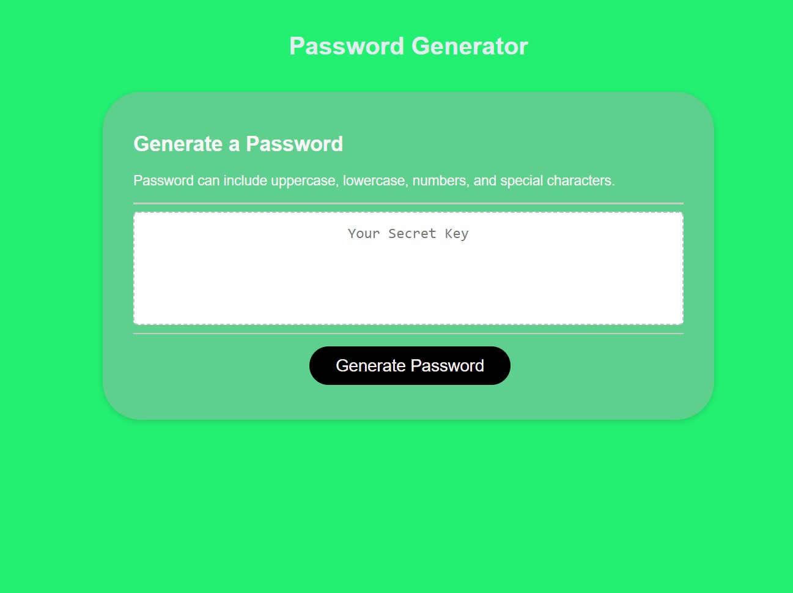

# SecretKey

## Description
This app was missing javascript so that the page can react when clicking gereate password. The codes added into javascript let's the page be responsive. When you click on Generate Password at the bottom, the app now has a pop up box requesting how long your password is, if you'd like uppercase, lowercase or special characters. When clicking through questionaire then your password is generated.

## Technologies Used
JavaScript, changing some css

## Installation
There is no Installation necessary.

## Credits
none

## User Story
AS AN employee with access to sensitive data 
I WANT to randomly generate a password that meets certain criteria 
SO THAT I can create a strong password that provides greater security

## Acceptance Criteria 
GIVEN I need a new, secure password 
WHEN I click the button to generate a password 
THEN I am presented with a series of prompts for password criteria 
WHEN prompted for password criteria 
THEN I select which criteria to include in the password 
WHEN prompted for the length of the password 
THEN I choose a length of at least 8 characters and no more than 128 characters 
WHEN asked for character types to include in the password 
THEN I confirm whether or not to include lowercase, uppercase, numeric, and/or special characters 
WHEN I answer each prompt 
THEN my input should be validated and at least one character type should be selected 
WHEN all prompts are answered 
THEN a password is generated that matches the selected criteria 
WHEN the password is generated 
THEN the password is either displayed in an alert or written to the page

## Usage

## Links
<a href="https://lexxvasquez.github.io/SecretKey/"target="_blank">deployed site</a>

<a href="https://github.com/Lexxvasquez/SecretKey"target="_blank">github</a>